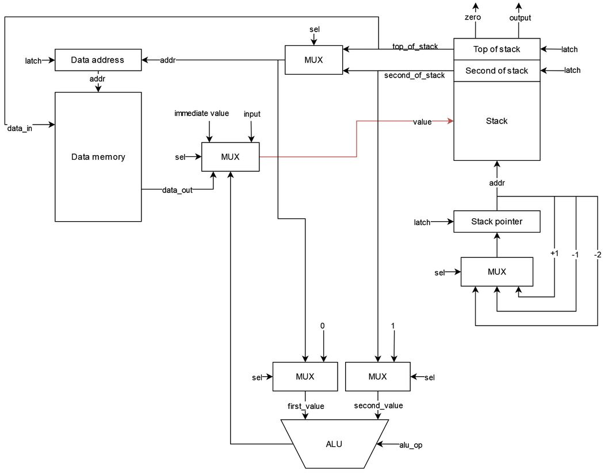
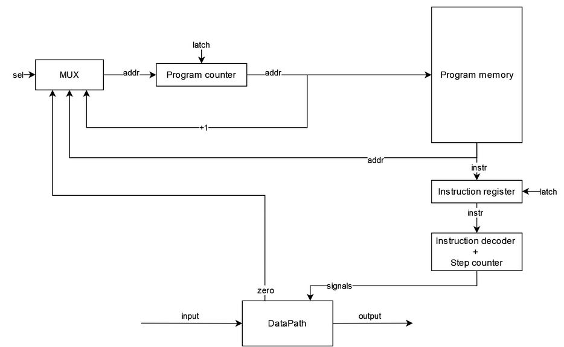

# Архитектура компьютера. Лабораторная работа 3

- Овчинников Илья Сергеевич, P3221
- `asm | stack | harv | hw | instr | struct | stream | mem | cstr | prob2`
- Упрощенный вариант

## Язык программирования
``` ebnf
prog ::= [data_section] [code_section]

data_section ::= "section .data:" [comment] "\n" {data_instr} 

data_instr ::= name data [comment] "\n"

data ::= "num" number 
       | "str" string
       | "buf" number

code_section ::= "section .code:" [comment] "\n" {code_instr}

code_instr ::= label [comment]
            | instr [comment]
            | [comment] "\n"
            
label ::= name ":" "\n"

instr ::= op0
        | op1
        
op0 ::= "hlt"
      | "pop"
      | "get"
      | "drp"
      | "dup"
      | "inc"
      | "add"
      | "div"
      | "mod"
      | "inp"
      | "out"
      
op1 ::= "jmp" name
      | "jmz" name
      | "psh" name 
      | "psh" number
      | "psh2" name
      | "psh" number
        
comment ::= ";" {<any except "\n">}

number ::= ["-"] { <any of "0-9"> }

name ::= <any of "a-z A-Z _"> { <any of "a-z A-Z 0-9 _"> }

string ::= '"' {<any except "\n" ";" '"'>} '"'
```

_Операции потока программы_
- `hlt` - стоп программы
- `jmp` - перейти к метке (адресу памяти команд)
- `jmz` - перейти к метке (адресу памяти команд), если на вершине стека 0, **НЕ удаляет вершину стека**

_Операции работы со стеком_
- `psh` - закинуть значение на вершину стека (например, если указать имя переменной, то это поместит её адрес)
- `psh2` - закинуть значение на вторым в стек
- `pop` - поместить первое значение в стеке по адресу второго
- `get` - заменить вершину стека на данные, взяв вершину стека как адрес
- `drp` - удалить верхнее значение из стека
- `dup` - дублировать значение на стеке

_Арифметические операции_
- `inc` - увеличить на один значение на вершине стека
- `add` - сложить второе с первым, результат на вершину стека
- `div` - поделить нацело второе на первое, результат на вершину стека
- `mod` - остаток от деления второго на первое, результат на вершину стека

_Операции работы с I\O_
- `inp` - ввести значение извне в стек
- `out` - вывести значение с вершины стека 

_Типы данных_
- `str` - нул-терминированная строка
- `buf` - буфер заполненный нулями
- `num` - целое число

Особенности: 
- Код выполняется последовательно
- При трансляции все метки в коде заменяются на соответствующие адреса
- По умолчанию при чтении значения в стеке, оно удаляется
- Память выделяется и заполняется начальными значениями статически при запуске модели
- Видимость данных - глобальная
- Литералы:
  - Целое число
  - Строка

## Организация памяти
Модель памяти процессора:
- Гарвардская архитектура - память данных и память команд
- Память команд:
  - Машинное слово - одна инструкция 
  - Реализуется списком словарей, описывающих инструкции (одно слово - одна ячейка).
  - Линейное адресное пространство
- Память данных:
  - Машинное слово - 32 бита, знаковое
  - Линейное адресное пространство
  - Реализуется списком целых чисел
  - Одно число - одно значение
- Адресация абсолютная (`jmp` `jmz`)
- Прямая загрузка (`psh`, `psh2`)
- Управление процессором hardwired (на уровне python-кода) - сигналы, реализованные функциями

Модель памяти:
- При запуске программы память выделяется статически и разделена на память данных, команд
- Система команд построена вокруг стека, поэтому все инструкции (кроме управляющих потоком программы) так или иначе взаимодействуют с ним
- Все регистры вспомогательные и прямого доступа у программиста к ним нет
- Можно осуществлять чтение и запись в память данных, в то время как к памяти команд можно обращаться с помощью меток при управлении потоком программы
- Инструкции хранятся в памяти команд
- Статические данные хранятся в памяти данных. К динамическим данным можно отнести загруженные с помощью `psh`, `psh2`, которые хранятся на стеке

```text
            Stack
+------------------------------+
| 00  : value                  |
|    ...                       |
| 10  : second of stack        | 
| 11  : top of stack           | <- stack pointer
|    ...                       |
+------------------------------+

       Instruction memory
+------------------------------+
| 00  : program start          |
| 01  : instruction            |
|    ...                       |
|    ...                       |
|  n  : HLT                    |
+------------------------------+

          Data memory
+------------------------------+
| 00  : value                  |
| 01  : value                  |
|    ...                       |
| l+0 : string value           |
| l+1 : \0                     |
|    ...                       |
| c+0 : buffer \0              |
| c+1 : buffer \0              |
|    ...                       |
+------------------------------+
```
- Литералы загружаются на стек с помощью `psh`, `psh2`
- Литералы изначально находятся в статической памяти, если объявлены в секции `section .data`
  - Порядок такой же как при объявлении
- Строки хранятся по символу в машинном слове, конец строки обозначается с помощью `\0`
- Констант нет
- Инструкции не изменяются после компиляции программы и загрузки их в память
- Переход к следующей инструкции осуществляется
  - Последовательно
  - Безусловно - `jmp`
  - Условно - `jmz`

## Система команд 
Особенности процессора
- Машинное слово - 32 бита, знаковое. Только абсолютная адресация
- Все данные представлены целым числом, поэтому с ними можно работать как с числом
- Регистры не доступны для программиста, но присутствуют специальные регистры
  - `program_counter` - хранит указатель на следующую инструкцию
  - `instruction_register` - хранит текущую инструкцию
  - `stack_pointer` - указатель на вершину стека
  - `data_address` - указатель на ячейку памяти данных
- Доступ к памяти данных осуществляется по адресу, хранящемуся в специальном регистре `Data address`
  - Установка адреса осуществляется путём автоматического инкрементирования или с помощью команд управления потоком программы
- Обработка данных:
  - Арифметические операции над значениями в стеке
  - Операции над стеком
  - Операциями ввода/вывода
- Ввод/вывод происходит с вершиной стека, через порт ввода/вывода соответственно
  - Порты реализованы с помощью списка чисел
- Поток управления:
  - Автоинкремент `Program counter`
  - Безусловный переход - `jmp`
  - Условный переход - `jmz`, если на вершине стека ноль
  - `hlt` - остановка программы

### Набор инструкций
- Все инструкции языка напрямую отображаются в инструкции процессора, за исключением инструкций выделения памяти для данных
- Первым тактом при выполнении инструкции всегда происходит выборка инструкции

Обозначения:
- PM - program memory
- DM - data memory
- DA - data address 
- PC - program counter
- Z - zero flag (на вершине стека ноль)
- SP - stack pointer
- TOS - top of stack
- SOS - second of stack
- IN - input port
- OUT - output port


Инструкции управления потоком программы

| Инструкция   | Кол-во тактов | Описание                 |
|--------------|:-------------:|--------------------------|
| `hlt`        |       2       | Остановка программы      |
| `jmp` [addr] |       2       | PC = PM[PC]              |
| `jmz` [addr] |       2       | IF Z: PC = PM[PC]        |

Инструкции работы со стеком

| Инструкция     | Кол-во тактов | Описание                             |
|----------------|:-------------:|--------------------------------------|
| `psh` [value]  |       3       | SP = SP + 1, TOS = PM[PC]            |
| `psh2` [value] |       4       | SP = SP + 1, TOS = SOS, SOS = PM[PC] |
| `pop`          |       3       | DA = SOS, DM[DA] = TOS,  SP = SP - 2 |
| `get`          |       3       | DA = TOS, TOS = DM[DA]               |
| `drp`          |       2       | SP = SP - 1                          |
| `dup`          |       3       | SP = SP + 1, TOS = SOS               |

Инструкции арифметики

| Инструкция | Кол-во тактов | Описание                     |
|------------|:-------------:|------------------------------|
| `inc`      |       2       | TOS = TOS + 1                |
| `add`      |       2       | SOS = SOS + TOS, SP = SP - 1 |
| `div`      |       2       | SOS = SOS / TOS, SP = SP - 1 |
| `mod`      |       2       | SOS = SOS % TOS, SP = SP - 1 |

Инструкции работы с I/O
- `inp` - преобразуется в `psh` + `get`
- `out` - преобразуется в `psh2` + `pop`


### Кодирование инструкций
- Машинный код в формате списка JSON `{"index": index, "opcode": opcode, "arg": arg}` и чисел
- Одна инструкция - один словарь или число
- Все инструкции данных заменяются на соответсвующее данные
- Вместо меток подставляется адрес в памяти 

Пример:
```text
[2,
 0,
 0,
 {"index": 0, "opcode": "psh", "arg": 0},
 {"index": 1, "opcode": "get", "arg": null},
 {"index": 2, "opcode": "jmz", "arg": 6},
 {"index": 3, "opcode": "psh2", "arg": 1},
 {"index": 4, "opcode": "pop", "arg": null},
 {"index": 5, "opcode": "jmp", "arg": 0},
 {"index": 6, "opcode": "drp", "arg": null},
 {"index": 7, "opcode": "hlt", "arg": null}]
```

В модуле [isa.py](./cpu/isa.py) тип данных `Opcode` - перечисление кодов операций с их строковым представлением

## Транслятор
Интерфейс командной строки:
```text
usage: translator.py [-h] source_file target_file
                                                 
Трансляция кода                                  
                                                 
positional arguments:                            
  source_file  Имя файла с кодом                 
  target_file  Имя выходного файла

options:
  -h, --help   show this help message and exit 
```

Реализовано в модуле [translator.py](./translator.py)

Этапы трансляции:
1. Выделение значимых токенов и перевод в список словарей
2. Подстановка адресов
3. Сохранение в файл

Принципы работы:
- Пустые строки или только с комментариями пропускаются
- Комментарии в строках отсекаются
- Два прохода: разделение на токены и отображение в машинный код
- Проверяется корректное число токенов в строке
- Проверяется, что метки и имена переменных не были переопределены
- Отдельная обработка сначала секций программы
- `section .data`:
  - Разделение на 3 токена по первым 2 пробелам
  - Замена на данные по типу данных
     - `num` - по значению
     - `str` - каждый символ = одно машинное слово, заканчивается `\0`
     - `buf` - заменяется на n `\0`
  - Сохранение адреса переменной для последующей замены обращений по имени
  - Первым словом в машинном коде записывается длина части данных
- `section .code`
  - Если оканчивается на `:` - метка, сохраняется адрес для последующей замены обращений по имени
  - Инструкции (кроме `inp` и `out`) прямо отображаются в машинный код
  - `inp` - преобразуется в `psh` + `get`
  - `out` - преобразуется в `psh2` + `pop`

## Модель процессора
Интерфейс командной строки:
```text
usage: start.py [-h] [--stack_size STACK_SIZE] [--debug_limit DEBUG_LIMIT] [--limit LIMIT] 
code_file [input_file]

Симуляция процессора

positional arguments:
  code_file             Имя файла бинарным с кодом
  input_file            Имя входного файла (опционально)

options:
  -h, --help            show this help message and exit
  --stack_size STACK_SIZE
                        Размер стека (по умолчанию 10)
  --debug_limit DEBUG_LIMIT
                        Лимит отладки (по умолчанию 200)
  --limit LIMIT         Лимит тиков (по умолчанию 100000)
```

Реализован в модуле: [start.py](./start.py)
- Стековая архитектура

### DataPath


Реализован в классе `DataPath` в модуле [datapath.py](./cpu/datapath.py)
- Сигналы реализованы в виде методов класса
- Управляющие сигналы приходят из `Contol Unit`
- `Data memory` - однопортовая память: либо читаем, либо пишем
- `ALU` - АЛУ для выполнения арифметических операций
- `Stack` - стек
- `Stack pointer` - указатель на вершину стека
- `Address register` - указатель на данные
- `input`/`output` - порты ввода/вывода

Сигналы:
- `latch_*` - защёлкнуть соответствующий регистр
- `sel_*` - выбрать значение на соответсвующее мультиплексоре
- `we` - активна запись в память
- `oe` - активно чтение из памяти
- `alu_op` - выбор арифметической операции

Флаги:
- `zero` - для проверки вершины стека на ноль

### ControlUnit


Реализован в классе `ControlUnit` в модуле [control_unit.py](./cpu/control_unit.py)   
- Сигналы реализованы в виде методов класса
- Управляющие сигналы определяются в методе `decode_and_execute`
- Цикл процессора реализован в методе `decode_and_execute`
  1. Выборка команды
  2. Определение опкода
  3. Вызов методов, симулирующих сигналы
- `Program memory` - только читаем
- `Program counter` - указатель на следующую инструкцию
- `Instruction register` - хранит текущую инструкцию
- `Instruction decoder` - декодирует опкод операции
- `input`/`output` - порты ввода/вывода

Сигналы:
- `latch_*` - защёлкнуть соответствующий регистр
- `sel_*` - выбрать значение на соответсвующее мультиплексоре

Особенности работы модели:
- Подготовка и запуск модели происходит в методе `simulation` в модуле [start.py](./start.py)
- Шаг моделирования равен одной инструкции процессора
- Для журнала состояний процессора используется стандартный модуль `logging`
  - Текущий тик
  - Текущая инструкция
  - Состояние регистров
  - Вершина стека
  - Состояние стека 
- Количество инструкций для моделирования и логирования лимитировано
- Остановка моделирования осуществляется при:
  - Превышении лимита количества выполняемых инструкций;
  - Исключении `EOFError` -- если нет данных для чтения из порта ввода;
  - Исключении `StopIteration` -- если выполнена инструкция `hlt`.

### Stack
- Представляют собой список целых чисел
- Управляющие сигналы приходят из `Control Unit`
- Считываются значения из верхних элементов стека

## Тестирование
Тестирование выполняется при помощи golden test-ов

- Реализованные программы лежат в [programs](./programs)
- Предлагаемые входные данные лежат в [texts](./texts)
- Конфигурации golden test-ов лежат в [golden](./golden) в виде файлов формата _.yml_
  - Код программы
  - Входные данные
  - Машинный код 
  - Выходные данные
  - Журнал работы процессора

Алгоритмы:
  - [cat](./golden/cat.yml) - вывод потенциально бесконечных входных данных
  - [hello](./golden/hello.yml) - вывод сообщения
  - [hello_user](./golden/hello_user.yml) - вывод приветствия пользователя с учетов ввода
  - [prob2](./golden/prob2.yml) - алгоритм на работу с числами

Запустить тесты: `poetry run pytest . -v`

Обновить конфигурацию golden tests: `poetry run pytest . -v --update-goldens`

Разбор теста `hello` ([hello](./golden/hello.yml))
- Код программы
```text
section .data:                  ; обозначаем начало секции данных
    str hello "Hello, world!"   ; объявляем переменную `hello` типа данных `str` со значением `Hello, world!`

section .code:                  ; обозначаем начало раздела кода

start:                          ; метка `start`
    psh hello                   ; кладём адрес переменной `hello` на стек

print:                          ; метка `print`
    dup                         ; дублируем значение на стеке для загрузки значения
    get                         ; загружаем значение по адресу с вершины стека
    jmz stop                    ; если на вершине `\0` (конец строки), то переходим к метке `break`
    out                         ; выводим значение с вершины стека на порт вывода
    inc                         ; инкрементируем значение на вершине стека (в данном случае - указатель на элемент сроки)
    jmp print                   ; переходим к метке `print`

stop:                           ; метка `stop`
    drp                         ; удаляем значение с вершины стека
    drp                         ; удаляем значение с вершины стека
    hlt                         ; остановка работы программы
```
- Вывод транслятора
```text
python .\translator.py .\programs\hello.asm .\out\hello.out
LoC: 20 Code instr: 28
```
- Машинный код
```text
[16,                                                                - длина части данных
 0, 0,                                                              - порты ввода/вывода
 72, 101, 108, 108, 111, 44, 32, 119, 111, 114, 108, 100, 33, 0,    - данные (строка `Hello world! и `\0`)
 {"index": 0, "opcode": "psh", "arg": 2},                           - код от сюда
 {"index": 1, "opcode": "dup", "arg": null},
 {"index": 2, "opcode": "get", "arg": null},
 {"index": 3, "opcode": "jmz", "arg": 8},
 {"index": 4, "opcode": "psh2", "arg": 1},
 {"index": 5, "opcode": "pop", "arg": null},
 {"index": 6, "opcode": "inc", "arg": null},
 {"index": 7, "opcode": "jmp", "arg": 1},
 {"index": 8, "opcode": "drp", "arg": null},
 {"index": 9, "opcode": "drp", "arg": null},
 {"index": 10, "opcode": "hlt", "arg": null}]                       - код до сюда
```
- Вывод процессора (логирование уровня INFO)
```text
python .\start.py .\out\hello.out
INFO:root:Start simulation
WARNING:root:Halt ere my magnificence, mortal, lest thou be consumed by the brilliance of my splendor
INFO:root:output_buffer: Hello, world!
INFO:root:End simulation
Hello, world!
Instructions: 98 Ticks: 263
```
- Журнал работы, логирование уровня DEBUG (часть)
```text
python .\start.py .\out\hello.out
INFO:root:Start simulation
DEBUG:root:TICK:    3 PUSH       PC:   1 DA:   0 SP:  0 TOS:   2 Stack: [2, -1, -1, -1, -1]
DEBUG:root:TICK:    6 DUP        PC:   2 DA:   0 SP:  1 TOS:   2 Stack: [2, 2, -1, -1, -1]
DEBUG:root:TICK:    9 LOAD       PC:   3 DA:   2 SP:  1 TOS:  72 Stack: [2, 72, -1, -1, -1]
DEBUG:root:TICK:   11 JZ         PC:   4 DA:   2 SP:  1 TOS:  72 Stack: [2, 72, -1, -1, -1]
DEBUG:root:TICK:   15 PUSH2      PC:   5 DA:   2 SP:  2 TOS:  72 Stack: [2, 1, 72, -1, -1]
DEBUG:root:output: H << 72
DEBUG:root:TICK:   18 POP        PC:   6 DA:   1 SP:  0 TOS:   2 Stack: [2, 1, 72, -1, -1]
DEBUG:root:TICK:   20 INC        PC:   7 DA:   1 SP:  0 TOS:   3 Stack: [3, 1, 72, -1, -1]
DEBUG:root:TICK:   22 JUMP       PC:   1 DA:   1 SP:  0 TOS:   3 Stack: [3, 1, 72, -1, -1]
DEBUG:root:TICK:   25 DUP        PC:   2 DA:   1 SP:  1 TOS:   3 Stack: [3, 3, 72, -1, -1]
DEBUG:root:TICK:   28 LOAD       PC:   3 DA:   3 SP:  1 TOS:  101 Stack: [3, 101, 72, -1, -1]
DEBUG:root:TICK:   30 JZ         PC:   4 DA:   3 SP:  1 TOS:  101 Stack: [3, 101, 72, -1, -1]
DEBUG:root:TICK:   34 PUSH2      PC:   5 DA:   3 SP:  2 TOS:  101 Stack: [3, 1, 101, -1, -1]
DEBUG:root:output: He << 101
DEBUG:root:TICK:   37 POP        PC:   6 DA:   1 SP:  0 TOS:   3 Stack: [3, 1, 101, -1, -1]
DEBUG:root:TICK:   39 INC        PC:   7 DA:   1 SP:  0 TOS:   4 Stack: [4, 1, 101, -1, -1]
DEBUG:root:TICK:   41 JUMP       PC:   1 DA:   1 SP:  0 TOS:   4 Stack: [4, 1, 101, -1, -1]
DEBUG:root:TICK:   44 DUP        PC:   2 DA:   1 SP:  1 TOS:   4 Stack: [4, 4, 101, -1, -1]
DEBUG:root:TICK:   47 LOAD       PC:   3 DA:   4 SP:  1 TOS:  108 Stack: [4, 108, 101, -1, -1]
DEBUG:root:TICK:   49 JZ         PC:   4 DA:   4 SP:  1 TOS:  108 Stack: [4, 108, 101, -1, -1]
DEBUG:root:TICK:   53 PUSH2      PC:   5 DA:   4 SP:  2 TOS:  108 Stack: [4, 1, 108, -1, -1]
DEBUG:root:output: Hel << 108
DEBUG:root:TICK:   56 POP        PC:   6 DA:   1 SP:  0 TOS:   4 Stack: [4, 1, 108, -1, -1]
...
```

### CI
CI при помощи Github Action

[python.yml](./.github/workflows/python.yml)
- `poetry` - управления зависимостями для языка программирования Python.
- `coverage` - формирование отчёта об уровне покрытия исходного кода.
- `pytest` - утилита для запуска тестов.
- `ruff` - утилита для форматирования и проверки стиля кодирования.

Запускается при пуше в репозиторий на ветку мастер
Тестовые процессы
- `test` - запуск тестов
- `lint` - запуск линтера

### Для сбора аналитики

| ФИО                        | алг             | LoC | code байт | code инстр. | инстр. | такт. | вариант                                                                   |
|:---------------------------|:----------------|:----|:----------|:------------|:-------|:------|:--------------------------------------------------------------------------|
| Овчинников Илья Сергеевич  | cat             | 12  | -         | 11          | 29     | 79    | `asm - stack - harv - hv - instr - struct - stream - port - cstr - prob2` |
| Овчинников Илья Сергеевич  | hello           | 20  | -         | 28          | 98     | 263   | `asm - stack - harv - hv - instr - struct - stream - port - cstr - prob2` |
| Овчинников Илья Сергеевич  | hello_user_name | 48  | -         | 92          | 125    | 330   | `asm - stack - harv - hv - instr - struct - stream - port - cstr - prob2` |

